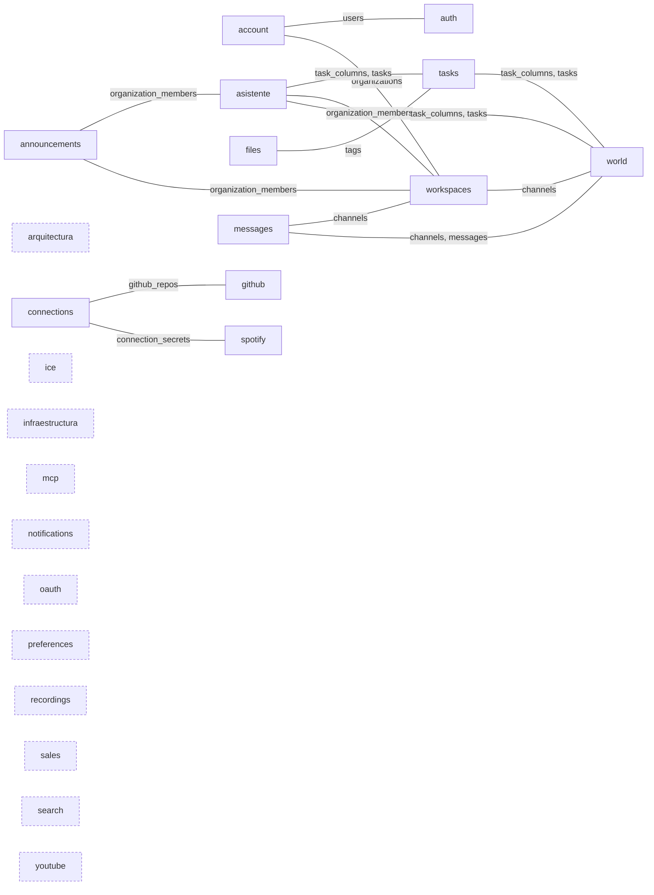

# El grafo de DevUP

> Generado leyendo el código con `npm run grafo`. **No se edita a mano**: lo que se escriba aquí
> desaparece en la siguiente pasada. Última: 2026-09-11.

Hoy el proyecto tiene **23 áreas de API**, **17 pantallas**, **12 componentes que hablan con la API** y **50 tablas** repartidas en 34 migraciones.

## Qué áreas se tocan de verdad

Dos áreas están acopladas cuando escriben en la misma tabla, se importen o no entre ellas.
Ese es el único parentesco que cuenta, y es el que enseña este diagrama.

Las tablas que tocan 4 áreas o más quedan fuera: son el armazón del producto y no
distinguen a nadie —con ellas dentro, todo aparece conectado con todo—. Hoy son `connections`, `files`, `profiles`, `workspaces`.

**Islas** (con el borde punteado): `arquitectura`, `ice`, `infraestructura`, `mcp`, `notifications`, `oauth`, `preferences`, `recordings`, `sales`, `search`, `youtube`. No comparten ninguna tabla con nadie. No es necesariamente un defecto —hay áreas que deben bastarse solas— pero sí es lo que hace que el producto se sienta como varias herramientas en la misma barra lateral.

## El mapa completo

Todo a la vez: cada pantalla, el área a la que llama, las tablas que esa área escribe y con qué
habla fuera. Es grande a propósito —es el proyecto entero— y se lee mejor abriéndolo a pantalla
completa. Para entender cómo encaja algo concreto, el diagrama de arriba y las tablas de abajo
dicen lo mismo en pequeño.

```mermaid
graph LR
  subgraph Pantallas_y_componentes
    P__app_autorizar_agente["/app/autorizar-agente"]
    P__app_o__orgId_ajustes["/app/o/:orgId/ajustes"]
    P__app_o__orgId_base_de_datos["/app/o/:orgId/base-de-datos"]
    P__app_o__orgId_buscar["/app/o/:orgId/buscar"]
    P__app_o__orgId_github["/app/o/:orgId/github"]
    P__app_o__orgId_infraestructura["/app/o/:orgId/infraestructura"]
    P__app_o__orgId_integraciones["/app/o/:orgId/integraciones"]
    P__app_o__orgId_noticias["/app/o/:orgId/noticias"]
    P__app_o__orgId_ventas["/app/o/:orgId/ventas"]
    P__app["/app"]
    P__app_w__workspaceId_asistente["/app/w/:workspaceId/asistente"]
    P__app_w__workspaceId_cuenta["/app/w/:workspaceId/cuenta"]
    P__app_w__workspaceId_mesa["/app/w/:workspaceId/mesa"]
    P__app_w__workspaceId_panel["/app/w/:workspaceId/panel"]
    P__invitacion["/invitacion"]
    P__login["/login"]
    P__recuperar["/recuperar"]
    P_arquitectura_Diagrama["arquitectura/Diagrama"]
    P_chat_ChannelChat["chat/ChannelChat"]
    P_dev_DevWorkspace["dev/DevWorkspace"]
    P_files_FileLibrary["files/FileLibrary"]
    P_files_FilePreview["files/FilePreview"]
    P_notifications_NotificationBell["notifications/NotificationBell"]
    P_spotify_piezas["spotify/piezas"]
    P_tasks_AdjuntosTarea["tasks/AdjuntosTarea"]
    P_tasks_TaskBoard["tasks/TaskBoard"]
    P_ui_PaletaComandos["ui/PaletaComandos"]
    P_ui_SelectorPresencia["ui/SelectorPresencia"]
    P_world_WorldView["world/WorldView"]
  end
  subgraph API
    A_account["account"]
    A_announcements["announcements"]
    A_arquitectura["arquitectura"]
    A_asistente["asistente"]
    A_auth["auth"]
    A_connections["connections"]
    A_files["files"]
    A_github["github"]
    A_ice["ice"]
    A_infraestructura["infraestructura"]
    A_mcp["mcp"]
    A_messages["messages"]
    A_notifications["notifications"]
    A_oauth["oauth"]
    A_preferences["preferences"]
    A_recordings["recordings"]
    A_sales["sales"]
    A_search["search"]
    A_spotify["spotify"]
    A_tasks["tasks"]
    A_workspaces["workspaces"]
    A_world["world"]
    A_youtube["youtube"]
  end
  subgraph Tablas
    T_users[("users")]
    T_profiles[("profiles")]
    T_sessions[("sessions")]
    T_organizations[("organizations")]
    T_organization_members[("organization_members")]
    T_workspaces[("workspaces")]
    T_channels[("channels")]
    T_tags[("tags")]
    T_files[("files")]
    T_file_tags[("file_tags")]
    T_call_sessions[("call_sessions")]
    T_task_columns[("task_columns")]
    T_tasks[("tasks")]
    T_task_tags[("task_tags")]
    T_call_recordings[("call_recordings")]
    T_call_recording_consents[("call_recording_consents")]
    T_messages[("messages")]
    T_invitations[("invitations")]
    T_notifications[("notifications")]
    T_world_rooms[("world_rooms")]
    T_world_zones[("world_zones")]
    T_world_avatars[("world_avatars")]
    T_world_props[("world_props")]
    T_services[("services")]
    T_clients[("clients")]
    T_opportunities[("opportunities")]
    T_opportunity_items[("opportunity_items")]
    T_goals[("goals")]
    T_connections[("connections")]
    T_connection_secrets[("connection_secrets")]
    T_github_repos[("github_repos")]
    T_github_repo_stats[("github_repo_stats")]
    T_channel_listening_sessions[("channel_listening_sessions")]
    T_channel_queue_tracks[("channel_queue_tracks")]
    T_organization_links[("organization_links")]
    T_announcements[("announcements")]
    T_user_dashboard_prefs[("user_dashboard_prefs")]
    T_environments[("environments")]
    T_deployments[("deployments")]
    T_world_outfits[("world_outfits")]
    T_user_workbench_prefs[("user_workbench_prefs")]
    T_oauth_clients[("oauth_clients")]
    T_oauth_codes[("oauth_codes")]
    T_architecture_nodes[("architecture_nodes")]
    T_architecture_links[("architecture_links")]
  end
  subgraph Fuera
    C_despliegues{{"despliegues"}}
    C_github{{"github"}}
    C_integraciones{{"integraciones"}}
    C_migraciones{{"migraciones"}}
    C_youtube{{"youtube"}}
  end
  P__app_autorizar_agente --> A_oauth
  P__app_o__orgId_ajustes --> A_account
  P__app_o__orgId_ajustes --> A_workspaces
  P__app_o__orgId_base_de_datos --> A_github
  P__app_o__orgId_buscar --> A_search
  P__app_o__orgId_github --> A_connections
  P__app_o__orgId_github --> A_github
  P__app_o__orgId_infraestructura --> A_connections
  P__app_o__orgId_infraestructura --> A_infraestructura
  P__app_o__orgId_integraciones --> A_github
  P__app_o__orgId_noticias --> A_announcements
  P__app_o__orgId_noticias --> A_workspaces
  P__app_o__orgId_ventas --> A_sales
  P__app --> A_account
  P__app --> A_workspaces
  P__app_w__workspaceId_asistente --> A_asistente
  P__app_w__workspaceId_cuenta --> A_auth
  P__app_w__workspaceId_cuenta --> A_connections
  P__app_w__workspaceId_mesa --> A_preferences
  P__app_w__workspaceId_mesa --> A_workspaces
  P__app_w__workspaceId_panel --> A_notifications
  P__app_w__workspaceId_panel --> A_workspaces
  P__invitacion --> A_account
  P__login --> A_account
  P__login --> A_auth
  P__recuperar --> A_account
  P_arquitectura_Diagrama --> A_arquitectura
  P_chat_ChannelChat --> A_messages
  P_dev_DevWorkspace --> A_github
  P_files_FileLibrary --> A_files
  P_files_FilePreview --> A_files
  P_notifications_NotificationBell --> A_notifications
  P_spotify_piezas --> A_spotify
  P_spotify_piezas --> A_youtube
  P_tasks_AdjuntosTarea --> A_files
  P_tasks_TaskBoard --> A_files
  P_tasks_TaskBoard --> A_tasks
  P_tasks_TaskBoard --> A_workspaces
  P_ui_PaletaComandos --> A_search
  P_ui_SelectorPresencia --> A_preferences
  P_world_WorldView --> A_workspaces
  P_world_WorldView --> A_world
  A_account --> T_invitations
  A_account --> T_organizations
  A_account --> T_users
  A_account --> T_workspaces
  A_announcements --> T_announcements
  A_announcements --> T_organization_members
  A_announcements --> T_profiles
  A_arquitectura --> T_architecture_links
  A_arquitectura --> T_architecture_nodes
  A_asistente --> T_connections
  A_asistente --> T_files
  A_asistente --> T_organization_members
  A_asistente --> T_profiles
  A_asistente --> T_task_columns
  A_asistente --> T_tasks
  A_asistente --> T_workspaces
  A_auth --> T_profiles
  A_auth --> T_sessions
  A_auth --> T_users
  A_connections --> T_connection_secrets
  A_connections --> T_connections
  A_connections --> T_github_repos
  A_files --> T_file_tags
  A_files --> T_files
  A_files --> T_profiles
  A_files --> T_tags
  A_files --> T_workspaces
  A_github --> T_connections
  A_github --> T_github_repo_stats
  A_github --> T_github_repos
  A_github -.-> C_github
  A_github -.-> C_integraciones
  A_github -.-> C_migraciones
  A_infraestructura --> T_deployments
  A_infraestructura --> T_environments
  A_infraestructura -.-> C_despliegues
  A_messages --> T_channels
  A_messages --> T_files
  A_messages --> T_messages
  A_messages --> T_profiles
  A_notifications --> T_notifications
  A_notifications --> T_profiles
  A_oauth --> T_oauth_clients
  A_oauth --> T_oauth_codes
  A_preferences --> T_profiles
  A_preferences --> T_user_dashboard_prefs
  A_preferences --> T_user_workbench_prefs
  A_recordings --> T_call_recording_consents
  A_recordings --> T_call_recordings
  A_recordings --> T_call_sessions
  A_recordings --> T_files
  A_recordings --> T_profiles
  A_sales --> T_clients
  A_sales --> T_goals
  A_sales --> T_opportunities
  A_sales --> T_opportunity_items
  A_sales --> T_profiles
  A_sales --> T_services
  A_spotify --> T_channel_listening_sessions
  A_spotify --> T_channel_queue_tracks
  A_spotify --> T_connection_secrets
  A_spotify --> T_connections
  A_tasks --> T_files
  A_tasks --> T_profiles
  A_tasks --> T_tags
  A_tasks --> T_task_columns
  A_tasks --> T_task_tags
  A_tasks --> T_tasks
  A_tasks --> T_workspaces
  A_workspaces --> T_channels
  A_workspaces --> T_organization_links
  A_workspaces --> T_organization_members
  A_workspaces --> T_organizations
  A_workspaces --> T_profiles
  A_workspaces --> T_workspaces
  A_world --> T_channels
  A_world --> T_files
  A_world --> T_messages
  A_world --> T_task_columns
  A_world --> T_tasks
  A_world --> T_world_avatars
  A_world --> T_world_outfits
  A_world --> T_world_props
  A_world --> T_world_rooms
  A_world --> T_world_zones
  A_youtube -.-> C_youtube
```

## Cada área: qué expone, qué escribe y con quién habla fuera

| Área | Puntos de entrada | Tablas que toca | Fuera |
|---|---|---|---|
| `account` | 10 | `invitations`, `organizations`, `users`, `workspaces` | — |
| `announcements` | 4 | `announcements`, `organization_members`, `profiles` | — |
| `arquitectura` | 6 | `architecture_links`, `architecture_nodes` | — |
| `asistente` | 2 | `connections`, `files`, `organization_members`, `profiles`, `task_columns`, `tasks`, `workspaces` | — |
| `auth` | 11 | `profiles`, `sessions`, `users` | — |
| `connections` | 5 | `connection_secrets`, `connections`, `github_repos` | — |
| `files` | 11 | `file_tags`, `files`, `profiles`, `tags`, `workspaces` | — |
| `github` | 8 | `connections`, `github_repo_stats`, `github_repos` | `github`, `integraciones`, `migraciones` |
| `ice` | 1 | — | — |
| `infraestructura` | 5 | `deployments`, `environments` | `despliegues` |
| `mcp` | 3 | — | — |
| `messages` | 6 | `channels`, `files`, `messages`, `profiles` | — |
| `notifications` | 3 | `notifications`, `profiles` | — |
| `oauth` | 5 | `oauth_clients`, `oauth_codes` | — |
| `preferences` | 5 | `profiles`, `user_dashboard_prefs`, `user_workbench_prefs` | — |
| `recordings` | 2 | `call_recording_consents`, `call_recordings`, `call_sessions`, `files`, `profiles` | — |
| `sales` | 15 | `clients`, `goals`, `opportunities`, `opportunity_items`, `profiles`, `services` | — |
| `search` | 1 | — | — |
| `spotify` | 12 | `channel_listening_sessions`, `channel_queue_tracks`, `connection_secrets`, `connections` | — |
| `tasks` | 8 | `files`, `profiles`, `tags`, `task_columns`, `task_tags`, `tasks`, `workspaces` | — |
| `workspaces` | 21 | `channels`, `organization_links`, `organization_members`, `organizations`, `profiles`, `workspaces` | — |
| `world` | 8 | `channels`, `files`, `messages`, `task_columns`, `tasks`, `world_avatars`, `world_outfits`, `world_props`, `world_rooms`, `world_zones` | — |
| `youtube` | 3 | — | `youtube` |

## Cada punto de entrada

| Método | Ruta | Área |
|---|---|---|
| GET | `/auth/signup-policy` | `account` |
| GET | `/invitations/:token` | `account` |
| POST | `/organizations/:orgId/invitations` | `account` |
| GET | `/organizations/:orgId/invitations` | `account` |
| DELETE | `/invitations/:id` | `account` |
| POST | `/invitations/accept` | `account` |
| POST | `/auth/verify-email/resend` | `account` |
| POST | `/auth/verify-email` | `account` |
| POST | `/auth/forgot-password` | `account` |
| POST | `/auth/reset-password` | `account` |
| GET | `/organizations/:orgId/announcements` | `announcements` |
| POST | `/organizations/:orgId/announcements` | `announcements` |
| PATCH | `/announcements/:id` | `announcements` |
| DELETE | `/announcements/:id` | `announcements` |
| GET | `/organizations/:orgId/architecture` | `arquitectura` |
| POST | `/organizations/:orgId/architecture/nodes` | `arquitectura` |
| PATCH | `/architecture/nodes/:nodeId` | `arquitectura` |
| DELETE | `/architecture/nodes/:nodeId` | `arquitectura` |
| POST | `/architecture/links` | `arquitectura` |
| DELETE | `/architecture/links/:linkId` | `arquitectura` |
| GET | `/me/asistente` | `asistente` |
| POST | `/workspaces/:workspaceId/asistente` | `asistente` |
| POST | `/auth/register` | `auth` |
| POST | `/auth/login` | `auth` |
| POST | `/auth/refresh` | `auth` |
| POST | `/auth/logout` | `auth` |
| GET | `/auth/me` | `auth` |
| GET | `/auth/ws-ticket` | `auth` |
| GET | `/auth/google` | `auth` |
| GET | `/auth/google/callback` | `auth` |
| GET | `/auth/sessions` | `auth` |
| POST | `/auth/agent-connections` | `auth` |
| DELETE | `/auth/sessions/:id` | `auth` |
| GET | `/organizations/:orgId/connections` | `connections` |
| POST | `/organizations/:orgId/connections` | `connections` |
| GET | `/connections` | `connections` |
| POST | `/connections` | `connections` |
| DELETE | `/connections/:connectionId` | `connections` |
| GET | `/organizations/:orgId/tags` | `files` |
| POST | `/organizations/:orgId/tags` | `files` |
| DELETE | `/tags/:tagId` | `files` |
| GET | `/tasks/:taskId/files` | `files` |
| GET | `/workspaces/:workspaceId/files` | `files` |
| GET | `/files/:fileId` | `files` |
| POST | `/workspaces/:workspaceId/files` | `files` |
| POST | `/files/:fileId/confirm` | `files` |
| GET | `/files/:fileId/download-url` | `files` |
| PATCH | `/files/:fileId` | `files` |
| DELETE | `/files/:fileId` | `files` |
| GET | `/organizations/:orgId/github/repos` | `github` |
| POST | `/organizations/:orgId/github/repos` | `github` |
| GET | `/github/repos/:repoId/migraciones` | `github` |
| GET | `/github/repos/:repoId/integraciones` | `github` |
| POST | `/github/repos/:repoId/refresh` | `github` |
| GET | `/github/repos/:repoId/tree` | `github` |
| GET | `/github/repos/:repoId/file` | `github` |
| DELETE | `/github/repos/:repoId` | `github` |
| GET | `/calls/ice-servers` | `ice` |
| GET | `/organizations/:orgId/environments` | `infraestructura` |
| GET | `/environments/:envId/deployments` | `infraestructura` |
| POST | `/organizations/:orgId/environments` | `infraestructura` |
| POST | `/environments/:envId/sync` | `infraestructura` |
| DELETE | `/environments/:envId` | `infraestructura` |
| POST | `/mcp` | `mcp` |
| GET | `/mcp` | `mcp` |
| DELETE | `/mcp` | `mcp` |
| GET | `/channels/:channelId/messages` | `messages` |
| POST | `/channels/:channelId/messages` | `messages` |
| PATCH | `/messages/:messageId` | `messages` |
| DELETE | `/messages/:messageId` | `messages` |
| POST | `/channels/:channelId/read` | `messages` |
| GET | `/workspaces/:workspaceId/unread` | `messages` |
| GET | `/notifications` | `notifications` |
| POST | `/notifications/:id/read` | `notifications` |
| POST | `/notifications/read-all` | `notifications` |
| GET | `/.well-known/oauth-authorization-server` | `oauth` |
| POST | `/oauth/register` | `oauth` |
| GET | `/oauth/authorize` | `oauth` |
| POST | `/oauth/consentir` | `oauth` |
| POST | `/oauth/token` | `oauth` |
| GET | `/me/dashboard` | `preferences` |
| PUT | `/me/dashboard` | `preferences` |
| PATCH | `/me/profile` | `preferences` |
| GET | `/me/mesa/:workspaceId` | `preferences` |
| PUT | `/me/mesa/:workspaceId` | `preferences` |
| GET | `/channels/:channelId/recordings` | `recordings` |
| POST | `/recordings/:recordingId/file` | `recordings` |
| GET | `/organizations/:orgId/services` | `sales` |
| POST | `/organizations/:orgId/services` | `sales` |
| GET | `/organizations/:orgId/clients` | `sales` |
| POST | `/organizations/:orgId/clients` | `sales` |
| PATCH | `/clients/:clientId` | `sales` |
| DELETE | `/clients/:clientId` | `sales` |
| GET | `/organizations/:orgId/pipeline` | `sales` |
| POST | `/organizations/:orgId/opportunities` | `sales` |
| PATCH | `/opportunities/:dealId` | `sales` |
| GET | `/organizations/:orgId/goals` | `sales` |
| POST | `/organizations/:orgId/goals` | `sales` |
| GET | `/opportunities/:dealId/items` | `sales` |
| POST | `/opportunities/:dealId/items` | `sales` |
| PATCH | `/opportunity-items/:itemId` | `sales` |
| DELETE | `/opportunity-items/:itemId` | `sales` |
| GET | `/organizations/:orgId/search` | `search` |
| GET | `/integrations/spotify/authorize` | `spotify` |
| GET | `/integrations/spotify/callback` | `spotify` |
| GET | `/me/spotify/status` | `spotify` |
| DELETE | `/integrations/spotify` | `spotify` |
| GET | `/me/spotify/token` | `spotify` |
| GET | `/spotify/search` | `spotify` |
| GET | `/spotify/resolver` | `spotify` |
| GET | `/channels/:channelId/spotify/queue` | `spotify` |
| POST | `/channels/:channelId/spotify/queue` | `spotify` |
| DELETE | `/spotify/queue/:trackId` | `spotify` |
| GET | `/channels/:channelId/spotify/session` | `spotify` |
| POST | `/channels/:channelId/spotify/session` | `spotify` |
| GET | `/workspaces/:workspaceId/board` | `tasks` |
| POST | `/workspaces/:workspaceId/columns` | `tasks` |
| PATCH | `/columns/:columnId` | `tasks` |
| DELETE | `/columns/:columnId` | `tasks` |
| POST | `/workspaces/:workspaceId/tasks` | `tasks` |
| PATCH | `/tasks/:taskId` | `tasks` |
| POST | `/tasks/:taskId/move` | `tasks` |
| DELETE | `/tasks/:taskId` | `tasks` |
| GET | `/organizations` | `workspaces` |
| PATCH | `/organizations/:orgId` | `workspaces` |
| POST | `/organizations` | `workspaces` |
| GET | `/organizations/:orgId/members` | `workspaces` |
| POST | `/organizations/:orgId/members` | `workspaces` |
| DELETE | `/organizations/:orgId/members/:memberId` | `workspaces` |
| PATCH | `/organizations/:orgId/members/:memberId` | `workspaces` |
| POST | `/organizations/:orgId/logo` | `workspaces` |
| POST | `/organizations/:orgId/logo/confirm` | `workspaces` |
| GET | `/organizations/:orgId/logo-url` | `workspaces` |
| DELETE | `/organizations/:orgId/logo` | `workspaces` |
| GET | `/organizations/:orgId/links` | `workspaces` |
| POST | `/organizations/:orgId/links` | `workspaces` |
| DELETE | `/organizations/:orgId/links/:linkId` | `workspaces` |
| GET | `/organizations/:orgId/workspaces` | `workspaces` |
| POST | `/organizations/:orgId/workspaces` | `workspaces` |
| GET | `/workspaces/:workspaceId` | `workspaces` |
| GET | `/workspaces/:workspaceId/channels` | `workspaces` |
| POST | `/workspaces/:workspaceId/channels` | `workspaces` |
| GET | `/channels/:channelId` | `workspaces` |
| DELETE | `/channels/:channelId` | `workspaces` |
| GET | `/workspaces/:workspaceId/world` | `world` |
| PUT | `/world/zones/:zoneId/props` | `world` |
| GET | `/workspaces/:workspaceId/world/live` | `world` |
| POST | `/world/zones/:zoneId/reset` | `world` |
| PATCH | `/world/zones/:zoneId` | `world` |
| GET | `/world/avatars` | `world` |
| PUT | `/world/avatar` | `world` |
| DELETE | `/world/outfit/:workspaceId` | `world` |
| GET | `/youtube/policy` | `youtube` |
| GET | `/youtube/search` | `youtube` |
| GET | `/youtube/resolver` | `youtube` |

## Cada tabla: quién la toca y de qué migración salió

| Tabla | Migración | Áreas que la nombran |
|---|---|---|
| `announcements` | `0019_personalizacion.sql` | `announcements` |
| `architecture_links` | `0033_arquitectura.sql` | `arquitectura` |
| `architecture_nodes` | `0033_arquitectura.sql` | `arquitectura` |
| `call_participants` | `0003_calls.sql` | — |
| `call_recording_consents` | `0004_workspaces_tasks_recordings.sql` | `recordings` |
| `call_recordings` | `0004_workspaces_tasks_recordings.sql` | `recordings` |
| `call_sessions` | `0003_calls.sql` | `recordings` |
| `channel_listening_sessions` | `0017_spotify.sql` | `spotify` |
| `channel_members` | `0001_core.sql` | — |
| `channel_queue_tracks` | `0017_spotify.sql` | `spotify` |
| `channel_reads` | `0005_messages.sql` | — |
| `channels` | `0001_core.sql` | `messages`, `workspaces`, `world` |
| `clients` | `0012_ventas.sql` | `sales` |
| `connection_secrets` | `0015_vault.sql` | `connections`, `spotify` |
| `connections` | `0015_vault.sql` | `asistente`, `connections`, `github`, `spotify` |
| `deployments` | `0021_infraestructura.sql` | `infraestructura` |
| `environments` | `0021_infraestructura.sql` | `infraestructura` |
| `file_tags` | `0002_files.sql` | `files` |
| `files` | `0002_files.sql` | `asistente`, `files`, `messages`, `recordings`, `tasks`, `world` |
| `github_repo_stats` | `0016_github.sql` | `github` |
| `github_repos` | `0016_github.sql` | `connections`, `github` |
| `goals` | `0013_objetivos.sql` | `sales` |
| `invitations` | `0006_invitations_notifications.sql` | `account` |
| `messages` | `0005_messages.sql` | `messages`, `world` |
| `notifications` | `0006_invitations_notifications.sql` | `notifications` |
| `oauth_clients` | `0032_oauth_clientes.sql` | `oauth` |
| `oauth_codes` | `0032_oauth_clientes.sql` | `oauth` |
| `opportunities` | `0012_ventas.sql` | `sales` |
| `opportunity_items` | `0012_ventas.sql` | `sales` |
| `organization_links` | `0019_personalizacion.sql` | `workspaces` |
| `organization_members` | `0001_core.sql` | `announcements`, `asistente`, `workspaces` |
| `organizations` | `0001_core.sql` | `account`, `workspaces` |
| `profiles` | `0001_core.sql` | `announcements`, `asistente`, `auth`, `files`, `messages`, `notifications`, `preferences`, `recordings`, `sales`, `tasks`, `workspaces` |
| `services` | `0012_ventas.sql` | `sales` |
| `sessions` | `0001_core.sql` | `auth` |
| `tags` | `0002_files.sql` | `files`, `tasks` |
| `task_columns` | `0004_workspaces_tasks_recordings.sql` | `asistente`, `tasks`, `world` |
| `task_tags` | `0004_workspaces_tasks_recordings.sql` | `tasks` |
| `tasks` | `0004_workspaces_tasks_recordings.sql` | `asistente`, `tasks`, `world` |
| `user_dashboard_prefs` | `0019_personalizacion.sql` | `preferences` |
| `user_tokens` | `0006_invitations_notifications.sql` | — |
| `user_workbench_prefs` | `0025_mesa_de_trabajo.sql` | `preferences` |
| `users` | `0001_core.sql` | `account`, `auth` |
| `workspace_members` | `0027_miembros_por_workspace.sql` | — |
| `workspaces` | `0001_core.sql` | `account`, `asistente`, `files`, `tasks`, `workspaces` |
| `world_avatars` | `0007_world.sql` | `world` |
| `world_outfits` | `0023_atuendos_por_organizacion.sql` | `world` |
| `world_props` | `0010_world_editor.sql` | `world` |
| `world_rooms` | `0007_world.sql` | `world` |
| `world_zones` | `0007_world.sql` | `world` |

## Cada pantalla y componente: a qué áreas llama

| Pantalla o componente | Áreas que consume |
|---|---|
| `/app` | `account`, `workspaces` |
| `/app/autorizar-agente` | `oauth` |
| `/app/o/:orgId/ajustes` | `account`, `workspaces` |
| `/app/o/:orgId/base-de-datos` | `github` |
| `/app/o/:orgId/buscar` | `search` |
| `/app/o/:orgId/github` | `connections`, `github` |
| `/app/o/:orgId/infraestructura` | `connections`, `infraestructura` |
| `/app/o/:orgId/integraciones` | `github` |
| `/app/o/:orgId/noticias` | `announcements`, `workspaces` |
| `/app/o/:orgId/ventas` | `sales` |
| `/app/w/:workspaceId/asistente` | `asistente` |
| `/app/w/:workspaceId/cuenta` | `auth`, `connections` |
| `/app/w/:workspaceId/mesa` | `preferences`, `workspaces` |
| `/app/w/:workspaceId/panel` | `notifications`, `workspaces` |
| `/invitacion` | `account` |
| `/login` | `account`, `auth` |
| `/recuperar` | `account` |
| `arquitectura/Diagrama` | `arquitectura` |
| `chat/ChannelChat` | `messages` |
| `dev/DevWorkspace` | `github` |
| `files/FileLibrary` | `files` |
| `files/FilePreview` | `files` |
| `notifications/NotificationBell` | `notifications` |
| `spotify/piezas` | `spotify`, `youtube` |
| `tasks/AdjuntosTarea` | `files` |
| `tasks/TaskBoard` | `files`, `tasks`, `workspaces` |
| `ui/PaletaComandos` | `search` |
| `ui/SelectorPresencia` | `preferences` |
| `world/WorldView` | `workspaces`, `world` |

## Las funciones de la base, y quién las llama

Buena parte del sistema no escribe sus tablas desde una ruta sino desde una función
`security definer` dentro de Postgres, y es deliberado: es lo que impide que una petición de
usuario invente un despliegue o emita un token a nombre de otro. Estas son esas funciones y las
tablas que tocan por dentro.

| Función | Tablas que toca | Áreas que la llaman |
|---|---|---|
| `accept_invitation` | `invitations`, `organization_members`, `workspace_members` | `account`, `auth` |
| `add_member_by_email` | `organization_members`, `users` | `workspaces` |
| `agent_connection_open` | `sessions` | `auth` |
| `auth_by_google_sub` | `users` | `auth` |
| `auth_credentials` | `users` | `account`, `auth` |
| `auth_identity` | `users` | `auth` |
| `can_access_channel` | `channel_members`, `channels` | — (solo desde dentro) |
| `can_access_workspace` | `organization_members`, `workspace_members`, `workspaces` | — (solo desde dentro) |
| `channel_of_session` | `call_sessions` | — (solo desde dentro) |
| `consume_user_token` | `user_tokens` | `account` |
| `create_channel` | `channel_members`, `channels` | `workspaces` |
| `create_invitation` | `invitations`, `organization_members`, `users`, `workspace_members` | `account` |
| `create_organization` | `organizations` | `workspaces` |
| `ensure_world_room` | `channels`, `workspaces`, `world_rooms`, `world_zones` | `world` |
| `get_connection_secret_for_refresh` | `connection_secrets` | — (solo desde dentro) |
| `global_search` | `channels`, `clients`, `files`, `messages`, `opportunities`, `services`, `tasks`, `workspaces` | — (solo desde dentro) |
| `goal_deal_count` | `goals`, `opportunities` | `sales` |
| `goal_progress_cents` | `goals`, `opportunities` | `sales` |
| `handle_new_organization` | `organization_members` | — (solo desde dentro) |
| `handle_new_workspace` | `task_columns` | — (solo desde dentro) |
| `invitation_by_token` | `invitations`, `organizations`, `profiles`, `workspaces` | `account`, `auth` |
| `is_org_member` | `organization_members` | — (solo desde dentro) |
| `issue_user_token` | `user_tokens` | `account` |
| `join_call` | `call_participants`, `call_sessions` | — (solo desde dentro) |
| `leave_call` | `call_participants`, `call_sessions` | — (solo desde dentro) |
| `link_google` | `users` | `auth` |
| `list_github_repos_for_refresh` | `github_repos` | — (solo desde dentro) |
| `mark_channel_read` | `channel_reads` | `messages` |
| `mark_email_verified` | `users` | `account` |
| `mark_environment_synced` | `environments` | `infraestructura` |
| `notify` | `notifications`, `organization_members` | `account`, `notifications` |
| `oauth_code_consume` | `oauth_codes` | `oauth` |
| `opportunity_amount_cents` | `opportunity_items` | `sales` |
| `org_of_channel` | `channels`, `workspaces` | — (solo desde dentro) |
| `org_of_workspace` | `workspaces` | `world` |
| `org_role_of` | `organization_members` | — (solo desde dentro) |
| `reap_call_peer` | `call_participants`, `call_sessions` | — (solo desde dentro) |
| `record_recording_consent` | `call_recording_consents` | — (solo desde dentro) |
| `register_google_user` | `profiles`, `users` | `auth` |
| `register_user` | `profiles`, `users` | `auth` |
| `reset_world_zone` | `world_props`, `world_zones` | `world` |
| `resolve_mentions` | `channels`, `organization_members`, `profiles`, `workspaces` | `messages` |
| `save_world_props` | `world_props`, `world_zones` | `world` |
| `session_consume` | `sessions` | `auth`, `oauth` |
| `session_open` | `sessions` | `auth`, `oauth` |
| `session_revoke` | `sessions` | `auth` |
| `set_password` | `sessions`, `users` | `account` |
| `sweep_abandoned_uploads` | `files` | — (solo desde dentro) |
| `unread_counts` | `channel_reads`, `channels`, `messages` | `messages` |
| `upsert_deployment` | `deployments` | `infraestructura` |
| `upsert_github_repo_stats` | `github_repo_stats` | `github` |
| `upsert_world_avatar` | `world_avatars` | `world` |
| `upsert_world_outfit` | `world_outfits` | `world` |
| `user_count` | `users` | `account`, `auth` |
| `world_enabled_for_workspace` | `organizations`, `workspaces` | `world` |

## Tablas que ninguna ruta nombra

Ninguna ruta de la API las menciona en su SQL. La columna de la derecha dice por qué: casi
siempre porque las escribe una función desde dentro de Postgres. **Una tabla sin función y sin
área es la única que de verdad habría que mirar** — es donde aparecería algo que quedó sin usar.

Esta distinción no es teórica: un documento de este mismo repositorio llegó a dar `user_tokens`
por muerta y a proponer borrarla, y resultó que la escriben las funciones de verificar el correo
y recuperar la contraseña.

| Tabla | Migración | Quién la escribe |
|---|---|---|
| `call_participants` | `0003_calls.sql` | `join_call`, `leave_call`, `reap_call_peer` |
| `channel_members` | `0001_core.sql` | `can_access_channel`, `create_channel` |
| `channel_reads` | `0005_messages.sql` | `unread_counts`, `mark_channel_read` |
| `user_tokens` | `0006_invitations_notifications.sql` | `issue_user_token`, `consume_user_token` |
| `workspace_members` | `0027_miembros_por_workspace.sql` | `can_access_workspace`, `create_invitation`, `accept_invitation` |

