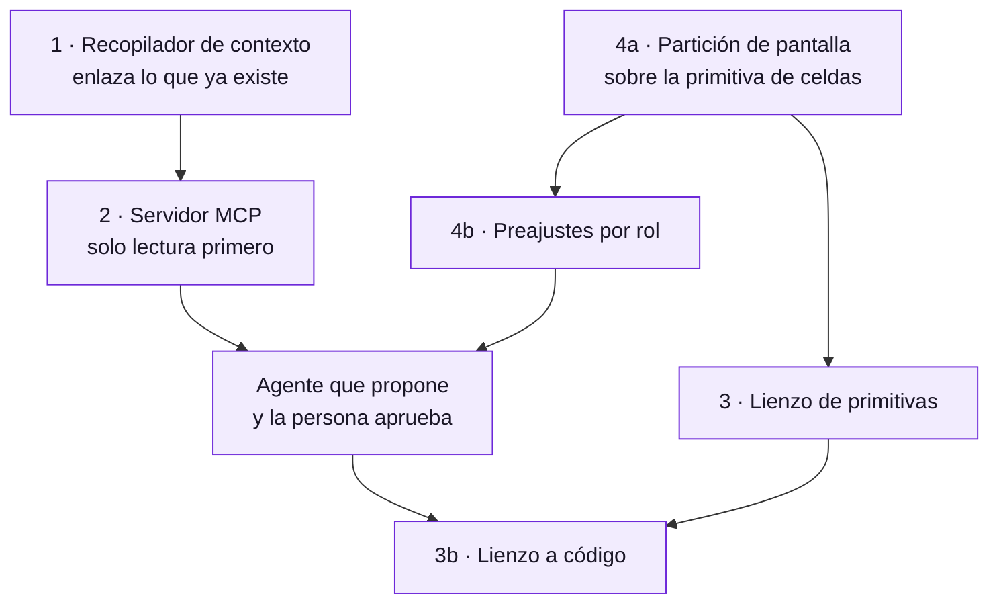

# Plan · DevUP como superficie de trabajo

Cuatro ideas nuevas para el plan de desarrollo, y una tarea de reorganización
visual que las ordena. Escrito el 29 de agosto de 2026.

No son cuatro ideas sueltas: **se sostienen entre sí**, y en un orden concreto.
El recopilador de contexto es lo que hace que el agente valga algo; el agente por
MCP es lo que hace que el diseño a código sea barato; y la reorganización visual
es la que permite que las tres quepan sin que la aplicación se vuelva un
cajón de sastre.

---

## 1. Recopilador de contexto

**La idea.** Notas enlazadas entre sí, con grafo, al estilo de Obsidian. Un sitio
donde vive el *porqué* de las cosas.

**Lo que no puede ser.** Otra aplicación de notas que nadie rellena. Ese es el
final de casi todas: se crean con ilusión, se llenan tres semanas y se abandonan,
porque escribir la nota es trabajo extra y su beneficio llega meses después y a
otra persona.

**Lo que sí puede ser, y es lo que lo hace distinto:** en DevUP el contexto **ya
existe y está disperso**. Hay decisiones discutidas en canales, cotizaciones con
su historia, tareas con su conversación, repositorios con sus commits, entornos
con sus despliegues, y cuatro documentos de decisión escritos a mano. Lo que no
hay es un hilo que los una.

Así que la nota no se escribe: **se deriva**. Una nota de contexto es un nodo que
enlaza cosas que ya pasaron, y el trabajo de la persona es confirmarla y
titularla, no redactarla.

**Primera rebanada, y es pequeña:** una tabla `notas_contexto` con enlaces
polimórficos a lo que ya existe —mensaje, archivo, tarea, cliente, repositorio,
entorno—, enlaces bidireccionales entre notas, y una vista de grafo. Más un
recolector que *proponga* notas: «esta conversación de catorce mensajes acabó en
un cambio de esquema; ¿la guardo como decisión?».

**Lo que hay que decidir antes:** si una nota pertenece a la organización o al
espacio de trabajo. Recomiendo organización: el porqué de una decisión sobrevive
al espacio donde se discutió.

---

## 2. El agente que cada uno prefiera, por MCP

**La idea.** Que DevUP hable por MCP con el motor agéntico que cada equipo ya
usa —Claude, ChatGPT, el que sea— y que ese agente pueda generar entrevistas,
proponer un roadmap, preparar reuniones y asignar tareas.

**Esto cambia una decisión que ya estaba tomada, y a mejor.** La decisión 0004
proponía lo contrario: que DevUP guardara una clave de API de Anthropic en la
bóveda y llamara al modelo. Eso nos convierte en intermediarios de un servicio
que no controlamos —con su factura, su elección de modelo y su responsabilidad
cuando el modelo se equivoca—.

Al revés es mejor en todo:

- **DevUP es un servidor MCP**, no un cliente de un modelo. Expone herramientas:
  leer un canal, listar tareas, crear una tarea, leer una nota de contexto, abrir
  un pull request, mirar el estado de un entorno.
- **El agente lo pone el equipo**, con su propia suscripción. Nosotros no
  pagamos tokens ni elegimos modelo por nadie.
- **La regla que ya estaba decidida sigue en pie y encaja sola:** *el agente
  propone y la persona aprueba*. La aprobación ocurre en DevUP, que es donde está
  el equipo. El agente vive fuera; la superficie donde se decide, dentro.
- Y el renglón «consumo de agente, medido aparte» de la tabla de precios
  **desaparece**, que es una conversación comercial menos.

**Dónde está el trabajo de verdad, y no es el protocolo.** Cada herramienta MCP
que escriba tiene que pasar por el mismo aislamiento que la API: con la identidad
de una persona y bajo sus políticas. Un servidor MCP que consulte la base con el
rol de la aplicación se salta RLS entero y le enseña a un agente los datos de
todas las organizaciones. Es exactamente el fallo silencioso que ya nos costó una
migración encontrar, con un agente delante repitiéndolo a escala.

**Primera rebanada:** cinco herramientas de solo lectura —canales, tareas,
repositorios, entornos, contexto— y ninguna de escritura. Se prueba el valor sin
poder romper nada, y el aislamiento se verifica con los mismos casos de
`isolation.test.ts` pero entrando por MCP.

---

## 3. Diseño a código

**La idea.** Crear diseños tipo Figma dentro de DevUP y llevarlos a código, con
ayuda del agente.

**Lo caro es importar Figma; lo valioso es no necesitarlo.** Un importador de
archivos de Figma es años de trabajo y produce siempre lo mismo: HTML plausible
que no es el de nadie, con divs absolutos y valores clavados, que hay que
reescribir entero. El problema no es la conversión: es que un diseño en píxeles
no contiene la información que el código necesita.

**La vuelta que lo hace barato:** que el lienzo dibuje **nuestras primitivas**.
El muestrario de `/dev/ui` ya tiene todas —botón, campo, desplegable, tarjeta,
chip, marco de página, los tres finales de una carga—. Si diseñar es componer
esas piezas en un lienzo, entonces el diseño **ya es** la estructura del
componente, y generar el código es imprimirlo. No hay traducción, y por tanto no
hay pérdida.

Lo que se gana además: un diseño así no puede salirse del sistema visual, que es
justo el problema que este equipo tuvo dieciséis veces seguidas.

Lo que se pierde, y hay que decirlo: no sirve para explorar formas nuevas. Para
eso sigue estando Figma, y está bien que así sea — esto es para diseñar
*producto*, no para diseñar el sistema.

**El agente encaja aquí sin esfuerzo:** con el lienzo hecho de primitivas, «hazme
la pantalla de facturas» es una composición que un agente puede proponer y una
persona corregir arrastrando.

---

## 4. La reorganización visual, que es la tarea que ordena todo

**El problema, dicho con precisión.** DevUP tiene veintiuna pantallas y todas
valen lo mismo: una lista plana en una barra lateral. Pero un desarrollador, un
diseñador, un scrum master y un product owner no usan las mismas cinco cosas ni
en la misma proporción, y hoy los cuatro navegan el mismo menú buscando lo suyo
entre lo de los demás.

**Jerarquía por sectores, no por permisos.** El rol aquí es **un preajuste de
disposición, no un muro**. Si «diseñador» impide entrar a la vista de
infraestructura, lo que se ha construido es un sistema de permisos que nadie
pidió, y el primer día que un diseñador necesite mirar un despliegue habrá que
desmontarlo. El rol decide **qué sale primero**, no qué se puede abrir.

**La partición de pantalla.** Elegir trabajar en una, dos o tres zonas, y poner
en cada una la herramienta que toque: el editor y el canal; el tablero y la
pizarra; el diseño y su código al lado.

**Y esto ya tiene precedente en casa, que es la mejor señal de que es
alcanzable.** El panel personal ya hace exactamente esto en pequeño: celdas, no
píxeles; arrastrar y estirar; guardado por persona; colapso a una columna en
pantalla estrecha. Extender ese modelo de la tarjeta al panel de herramientas es
la misma idea a otra escala.

**El aviso que importa:** o la partición usa esa misma primitiva, o acabaremos
con dos sistemas de disposición que se parecen y no son iguales — y ese es
precisamente el tipo de deriva que el bloque de interfaz acaba de costar
arreglar.

### Cómo empezar, y por dónde no

1. **Inventario de funciones por sector**, contado, no opinado: qué pantallas
   abre de verdad cada rol. Sin datos esto son preferencias discutidas en una
   reunión.
2. **La partición**, primero de dos zonas. Una es un caso especial de dos, y tres
   sale gratis si el modelo es de celdas.
3. **Los preajustes por rol**, que a esas alturas son cuatro disposiciones
   guardadas y no una funcionalidad nueva.
4. **Herramientas invocables**: que cada zona pueda llamar a cualquier pantalla
   sin salir de la disposición.

Empezar por los preajustes sería empezar por el final: sin partición, un preajuste
es un orden de menú.

---

## 5. En qué orden, y qué desbloquea qué

**El contexto va primero** porque es lo que hace que el agente valga algo. Un
agente conectado a DevUP sin contexto es una caja de chat con acceso a tareas;
con el porqué de las decisiones delante, es otra cosa.

**El servidor MCP va segundo** porque es lo más barato de todo lo que hay aquí y
lo que más cambia el producto: sustituye el bloque de agentes entero por una
integración, y de paso resuelve la decisión pendiente de «con qué credenciales»
—con las suyas—.

**La partición va en paralelo**, porque no depende de nada de lo anterior y es lo
único que se nota usando el producto desde el primer día.

**El lienzo va al final** porque es lo más caro y porque necesita que las
primitivas estén asentadas, que es algo que acaba de pasar.

---

## 6. Lo que hay que decidir antes de escribir código

| Decisión | Por qué bloquea |
|---|---|
| ¿La nota de contexto es de la organización o del espacio? | Cambia la política de aislamiento, y esa no se cambia después |
| ¿Se retira la clave de Anthropic de la decisión 0004? | Si DevUP es servidor MCP, guardar una clave de modelo deja de tener sentido |
| ¿Qué herramientas MCP pueden escribir, y cuáles nunca? | Es la misma pregunta de «qué puede tocar un agente», y ahora tiene una respuesta más fácil |
| ¿Los roles son preajustes o permisos? | Recomiendo preajustes. Si son permisos, esto se convierte en otro proyecto |

---

## 7. Lo que esto no cambia

El sistema visual base y el interior de DevVerse no se tocan de camino a nada de
esto. Y la regla de producto que ya estaba decidida sigue mandando sobre todo lo
anterior: **el agente propone y la persona aprueba**, y esa aprobación ocurre
dentro de DevUP.
