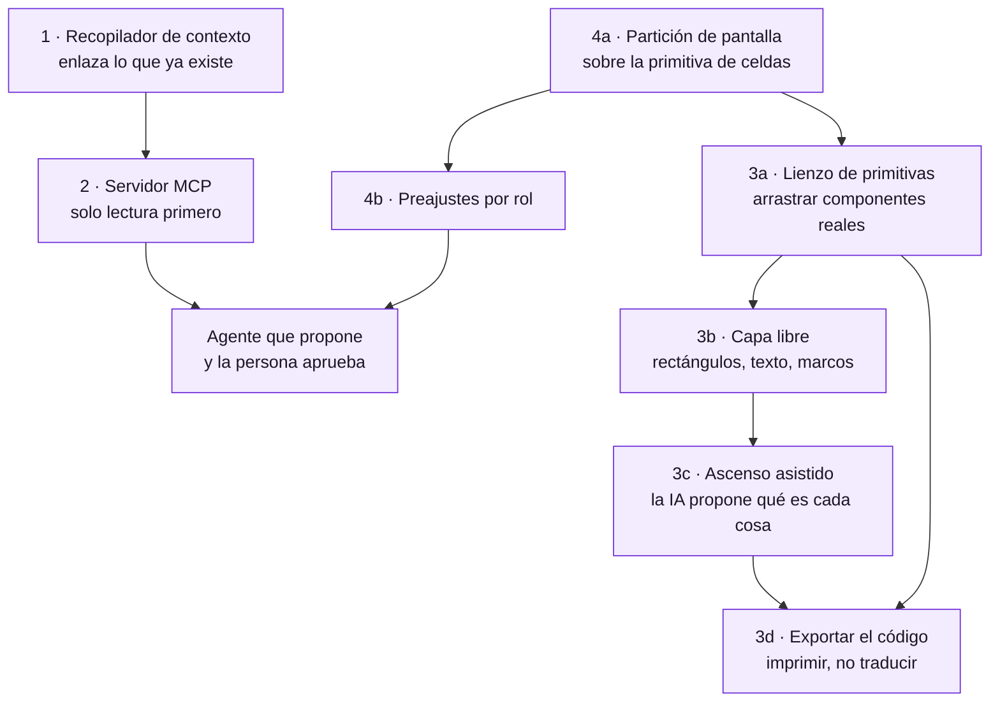

# Plan · DevUP como superficie de trabajo

Cuatro ideas nuevas para el plan de desarrollo, y una tarea de reorganización
visual que las ordena. Escrito el 29 de agosto de 2026.

No son cuatro ideas sueltas: **se sostienen entre sí**, y en un orden concreto.
El recopilador de contexto es lo que hace que el agente valga algo. El diseñador
propio solo sale barato si dibuja las primitivas que ya tenemos. Y la
reorganización visual es la que permite que las tres quepan sin que la aplicación
se vuelva un cajón de sastre.

Hay además un hilo que las recorre y conviene decirlo una vez: **lo que no se
guarda no se puede adivinar después**. Es lo que hace que el contexto tenga que
derivarse de lo que ya pasó en vez de escribirse, y lo que hace que un diseño
tenga que guardar intenciones y no píxeles. Ya lo aprendimos con la cola de
música, que guardaba el enlace de un servicio en vez de la canción.

---

## 1. Recopilador de contexto

**La idea.** Notas enlazadas entre sí, con grafo, al estilo de Obsidian. Un sitio
donde vive el *porqué* de las cosas.

**Lo que no puede ser.** Otra aplicación de notas que nadie rellena. Ese es el
final de casi todas: se crean con ilusión, se llenan tres semanas y se abandonan,
porque escribir la nota es trabajo extra y su beneficio llega meses después y a
otra persona.

**Lo que sí puede ser, y es lo que lo hace distinto:** en DevUP el contexto **ya
existe y está disperso**. Hay decisiones discutidas en canales, cotizaciones con
su historia, tareas con su conversación, repositorios con sus commits, entornos
con sus despliegues, y cuatro documentos de decisión escritos a mano. Lo que no
hay es un hilo que los una.

Así que la nota no se escribe: **se deriva**. Una nota de contexto es un nodo que
enlaza cosas que ya pasaron, y el trabajo de la persona es confirmarla y
titularla, no redactarla.

**Primera rebanada, y es pequeña:** una tabla `notas_contexto` con enlaces
polimórficos a lo que ya existe —mensaje, archivo, tarea, cliente, repositorio,
entorno—, enlaces bidireccionales entre notas, y una vista de grafo. Más un
recolector que *proponga* notas: «esta conversación de catorce mensajes acabó en
un cambio de esquema; ¿la guardo como decisión?».

**Lo que hay que decidir antes:** si una nota pertenece a la organización o al
espacio de trabajo. Recomiendo organización: el porqué de una decisión sobrevive
al espacio donde se discutió.

---

## 2. El agente que cada uno prefiera, por MCP

**La idea.** Que DevUP hable por MCP con el motor agéntico que cada equipo ya
usa —Claude, ChatGPT, el que sea— y que ese agente pueda generar entrevistas,
proponer un roadmap, preparar reuniones y asignar tareas.

**Esto cambia una decisión que ya estaba tomada, y a mejor.** La decisión 0004
proponía lo contrario: que DevUP guardara una clave de API de Anthropic en la
bóveda y llamara al modelo. Eso nos convierte en intermediarios de un servicio
que no controlamos —con su factura, su elección de modelo y su responsabilidad
cuando el modelo se equivoca—.

Al revés es mejor en todo:

- **DevUP es un servidor MCP**, no un cliente de un modelo. Expone herramientas:
  leer un canal, listar tareas, crear una tarea, leer una nota de contexto, abrir
  un pull request, mirar el estado de un entorno.
- **El agente lo pone el equipo**, con su propia suscripción. Nosotros no
  pagamos tokens ni elegimos modelo por nadie.
- **La regla que ya estaba decidida sigue en pie y encaja sola:** *el agente
  propone y la persona aprueba*. La aprobación ocurre en DevUP, que es donde está
  el equipo. El agente vive fuera; la superficie donde se decide, dentro.
- Y el renglón «consumo de agente, medido aparte» de la tabla de precios
  **desaparece**, que es una conversación comercial menos.

**Dónde está el trabajo de verdad, y no es el protocolo.** Cada herramienta MCP
que escriba tiene que pasar por el mismo aislamiento que la API: con la identidad
de una persona y bajo sus políticas. Un servidor MCP que consulte la base con el
rol de la aplicación se salta RLS entero y le enseña a un agente los datos de
todas las organizaciones. Es exactamente el fallo silencioso que ya nos costó una
migración encontrar, con un agente delante repitiéndolo a escala.

**Primera rebanada:** cinco herramientas de solo lectura —canales, tareas,
repositorios, entornos, contexto— y ninguna de escritura. Se prueba el valor sin
poder romper nada, y el aislamiento se verifica con los mismos casos de
`isolation.test.ts` pero entrando por MCP.

---

## 3. Nuestro propio diseñador de bocetos y MVP

**La idea.** Un diseñador dentro de DevUP para hacer bocetos y MVP —como se
haría en Figma— y, cuando el diseño está listo, que la IA lo pase a código.

### La trampa, dicha antes de empezar

Un diseñador libre produce píxeles: rectángulos, textos, posiciones. Pedirle a
un modelo que convierta píxeles en código produce siempre lo mismo, y no por
falta de talento del modelo: **la información no está ahí**. Un rectángulo gris
con texto dentro puede ser un botón, una etiqueta o una tarjeta, y ninguna
cantidad de inteligencia lo saca de la imagen con certeza. El resultado es
capas absolutas con valores clavados, que se reescriben enteras.

Es exactamente el mismo fallo que ya conocemos de otro sitio: cuando la
identidad no se guarda, adivinarla después sale mal. La cola de música guardaba
el enlace de Spotify en vez de la canción; un diseño que guarda píxeles en vez
de intenciones tiene el mismo problema.

### La forma de que sí funcione: el lienzo tiene dos capas

**Capa libre.** Rectángulos, texto, imágenes, marcos, capas, alineación. Para
explorar, que es para lo que sirve un boceto. Aquí se dibuja lo que sea, sin
reglas, y se enseña a un cliente en una reunión.

**Capa semántica.** Cualquier cosa del lienzo se puede **ascender a
componente**: «esto es un `Boton` primario», «esto es una `Tarjeta`», «esto es
un `Marco de página` con su título y sus acciones». Nuestras primitivas ya
existen todas y están en el muestrario de `/dev/ui`.

**Y aquí es donde la IA hace lo que de verdad sabe hacer.** No generar
maquetación a partir de una imagen —eso es adivinar—, sino **proponer el
ascenso**: mirar el boceto y decir «esto de aquí parece un botón primario, esto
una lista de tarjetas, esto un estado vacío». Eso es una correspondencia difusa
entre lo que se ve y un catálogo cerrado, que es justo el tipo de problema donde
un modelo acierta mucho y donde equivocarse es barato: se corrige con un clic.

Con el diseño ascendido, generar el código **deja de ser una traducción**: es
imprimir un árbol de componentes que ya existen, con nuestras clases y nuestro
sistema visual. No hay pérdida porque no hay conversión.

### Lo que se gana además, y no es pequeño

Un diseño hecho así **no puede salirse del sistema visual**. Ese fue el problema
que costó dieciséis pantallas construidas de una en una: no faltaba criterio,
faltaba que el criterio estuviera donde se diseña.

Y funciona en las dos direcciones: cuando cambie el botón, cambian todos los
diseños que lo usan. Un archivo de Figma no se entera nunca de que el sistema
cambió.

### Sobre la API del modelo, que es una decisión aparte

En el punto 2 se argumenta que DevUP **no** debe guardar una clave de un modelo:
que el agente lo ponga el equipo, por MCP, con su propia suscripción. Aquí es
distinto, y conviene separarlo bien porque parece lo mismo y no lo es:

| | Agente por MCP | Diseño a código |
|---|---|---|
| Qué hace | Trabaja continuamente con los datos de la organización | Una transformación puntual de un diseño |
| Cuánto cuesta | Sin techo: depende de cuánto lo usen | Acotado: se sabe antes de llamar |
| Quién responde si se equivoca | El equipo, que eligió su agente | Nosotros, porque es una función del producto |
| De quién es la clave | Del equipo | **Puede ser nuestra**, medida por uso |

Una conversión de diseño a código es una función del producto con un coste
acotado, como generar un PDF. Ahí sí tiene sentido incluir la clave y medir el
consumo. Lo que no tiene sentido es lo otro: pagar la cuenta de un agente que
trabaja todo el día para otro.

### Primera rebanada

1. **Lienzo con las primitivas**, sin capa libre todavía. Arrastrar un `Boton` y
   una `Tarjeta` a un marco y exportar el JSX. Es poco y ya sirve para montar
   una pantalla nueva sin escribirla.
2. **Capa libre** encima: rectángulos, texto y marcos, para bocetar de verdad.
3. **El ascenso asistido**, que es donde entra el modelo.

En ese orden y no al revés: si se empieza por la capa libre, la tentación será
generar código de los píxeles —que es la trampa— antes de que exista el catálogo
al que ascender.

## 4. La reorganización visual, que es la tarea que ordena todo

**El problema, dicho con precisión.** DevUP tiene veintiuna pantallas y todas
valen lo mismo: una lista plana en una barra lateral. Pero un desarrollador, un
diseñador, un scrum master y un product owner no usan las mismas cinco cosas ni
en la misma proporción, y hoy los cuatro navegan el mismo menú buscando lo suyo
entre lo de los demás.

**Jerarquía por sectores, no por permisos.** El rol aquí es **un preajuste de
disposición, no un muro**. Si «diseñador» impide entrar a la vista de
infraestructura, lo que se ha construido es un sistema de permisos que nadie
pidió, y el primer día que un diseñador necesite mirar un despliegue habrá que
desmontarlo. El rol decide **qué sale primero**, no qué se puede abrir.

**La partición de pantalla.** Elegir trabajar en una, dos o tres zonas, y poner
en cada una la herramienta que toque: el editor y el canal; el tablero y la
pizarra; el diseño y su código al lado.

**Y esto ya tiene precedente en casa, que es la mejor señal de que es
alcanzable.** El panel personal ya hace exactamente esto en pequeño: celdas, no
píxeles; arrastrar y estirar; guardado por persona; colapso a una columna en
pantalla estrecha. Extender ese modelo de la tarjeta al panel de herramientas es
la misma idea a otra escala.

**El aviso que importa:** o la partición usa esa misma primitiva, o acabaremos
con dos sistemas de disposición que se parecen y no son iguales — y ese es
precisamente el tipo de deriva que el bloque de interfaz acaba de costar
arreglar.

### Cómo empezar, y por dónde no

1. **Inventario de funciones por sector**, contado, no opinado: qué pantallas
   abre de verdad cada rol. Sin datos esto son preferencias discutidas en una
   reunión.
2. **La partición**, primero de dos zonas. Una es un caso especial de dos, y tres
   sale gratis si el modelo es de celdas.
3. **Los preajustes por rol**, que a esas alturas son cuatro disposiciones
   guardadas y no una funcionalidad nueva.
4. **Herramientas invocables**: que cada zona pueda llamar a cualquier pantalla
   sin salir de la disposición.

Empezar por los preajustes sería empezar por el final: sin partición, un preajuste
es un orden de menú.

---

## 5. En qué orden, y qué desbloquea qué

**El contexto va primero** porque es lo que hace que el agente valga algo. Un
agente conectado a DevUP sin contexto es una caja de chat con acceso a tareas;
con el porqué de las decisiones delante, es otra cosa.

**El servidor MCP va segundo** porque es lo más barato de todo lo que hay aquí y
lo que más cambia el producto: sustituye el bloque de agentes entero por una
integración, y de paso resuelve la decisión pendiente de «con qué credenciales»
—con las suyas—.

**La partición va en paralelo**, porque no depende de nada de lo anterior y es lo
único que se nota usando el producto desde el primer día.

**El diseñador va al final, y por dentro también tiene orden.** Primero el
lienzo de primitivas —arrastrar un botón y una tarjeta y exportar el código—,
que ya sirve para montar una pantalla sin escribirla. Después la capa libre para
bocetar de verdad. Y solo entonces el ascenso asistido.

Al revés sería el camino corto a la trampa: con la capa libre hecha y sin
catálogo al que ascender, la tentación es generar código de los píxeles.

---

## 6. Lo que hay que decidir antes de escribir código

| Decisión | Por qué bloquea |
|---|---|
| ¿La nota de contexto es de la organización o del espacio? | Cambia la política de aislamiento, y esa no se cambia después |
| ¿Se retira la clave de Anthropic de la decisión 0004? | Si DevUP es servidor MCP, guardar una clave de modelo deja de tener sentido |
| ¿Qué herramientas MCP pueden escribir, y cuáles nunca? | Es la misma pregunta de «qué puede tocar un agente», y ahora tiene una respuesta más fácil |
| ¿Los roles son preajustes o permisos? | Recomiendo preajustes. Si son permisos, esto se convierte en otro proyecto |
| ¿La clave del modelo para diseño a código la ponemos nosotros? | Recomiendo que sí, y medida: es una función con coste acotado, a diferencia de un agente que trabaja todo el día |
| ¿El diseñador guarda su propio formato o solo árboles de componentes? | Decide si la capa libre es de primera clase o un andamio que desaparece al ascender |

---

## 7. Lo que esto no cambia

El sistema visual base y el interior de DevVerse no se tocan de camino a nada de
esto. Y la regla de producto que ya estaba decidida sigue mandando sobre todo lo
anterior: **el agente propone y la persona aprueba**, y esa aprobación ocurre
dentro de DevUP.
