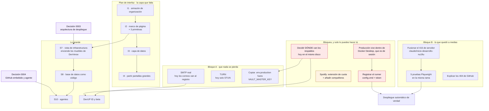

# Traspaso · 27 de agosto de 2026

Continúa [`traspaso-2026-08-18-fusion-y-boveda.md`](traspaso-2026-08-18-fusion-y-boveda.md).
Existe para que quien retome no vuelva a descubrir lo que ya costó descubrir.

Rama: `docs/traspaso-busqueda-boveda-github-spotify` · todo commiteado y desplegado.

---

## 1. Qué hacer ahora — el grafo

Las flechas son dependencias reales: lo de abajo no se puede hacer bien sin lo de
arriba. Lo que está en rojo bloquea de verdad.



**Lo que más pesa y menos cuesta:** decidir dónde van los respaldos. Es una línea
en `.env.production` y es lo único que hoy separa «tenemos copias» de «tenemos
copias que sirven».

---

## 2. Lo hecho en esta sesión

**Respaldos, con la restauración probada.** Dos servicios en el compose:
`pg_dump` de la base y `mc mirror` del almacén, cada uno con la herramienta
oficial de lo que respalda. `npm run respaldo:probar` restaura el último volcado
en una base desechable y compara filas con producción. Verificado: las diez
tablas coinciden.

**Dos temas, claro y oscuro**, con el morado como acento en los dos y «seguir al
sistema» por defecto. No se rehízo el sistema visual —eso sería tirar lo único
que sí se pensó de una vez, según el propio plan de interfaz—: se conservan los
cuatro niveles de superficie, los materiales y las reglas de movimiento, y solo
se añade una paleta y la maquinaria para conmutarla.

**La marca se enciende.** Del proyecto de diseño «Loading animation with purple
light», reimplementada sobre el sistema propio: sin JavaScript, vectorial, y con
variante de movimiento reducido. Hace de pantalla de arranque.

**Tres primitivas de movimiento más:** materializar (el cristal cuaja),
llegada (halo de una vez), y levantar/aterrizar en la rejilla del panel.

**Panel movible por rejilla**, con migración `0020`.

---

## 3. Las trampas que costaron tiempo, para no repetirlas

**El bucket del almacén nunca se había creado.** Ninguna subida había funcionado
jamás en producción. `ensureBucket()` lo intentaba en cada arranque y MinIO
rechazaba el XML del SDK; el aviso se perdía entre los registros. Lo difícil era
DÓNDE muere: la subida va en tres pasos y los bytes del segundo van directos del
navegador al almacén, así que desde el servidor solo se veía un paso 1 correcto
y ningún paso 3, sin un solo error.

**La API salía a internet para hablar con su propio almacén.** 154 ms contra 3 ms
por la red de contenedores, y sujeto a que la red de salida funcione para una
pregunta que el servidor puede responderse solo. Ahora hay dos clientes:
`S3_ENDPOINT` firma las URLs que abre el navegador, `S3_ENDPOINT_INTERNO` es por
donde habla el servidor.

**El 404 de Spotify tenía dos causas con dos remedios.** Reconectar el SDK suele
devolver el MISMO identificador, así que renovar de primeras reintenta contra un
dispositivo igual de muerto — seis 404 seguidos en producción. Primero se
transfiere la reproducción (que es lo que registra el dispositivo), y solo
después se reconecta.

**Los `.sh` a un checkout de romperse.** Con `core.autocrlf=true` git los
convierte a CRLF, y un `#!/bin/sh\r` no existe dentro de un contenedor Linux.
Arreglado con `.gitattributes` — pero es el tipo de fallo que vuelve si alguien
añade un script nuevo en otra carpeta.

**Un dominio bloqueado no es un servicio caído.** `ERR_CONNECTION_RESET` en todo
`hytrex.co` resultó ser el filtro de red de la Universidad de Ibagué. El TCP
abre y el TLS se corta; por HTTP se coló su propia página de bloqueo. Antes de
tocar el despliegue, comprobar si el dominio resuelve y responde desde OTRA red.

**Y dos veces me equivoqué afirmando sin comprobar:** dije que no había
integración continua (existe `ci.yml` y es completa) y que TURN estaba
configurado (las variables están vacías). Las dos veces bastaba un `grep`.

---

## 4. Lo que hay que saber para no romper nada

| | |
|---|---|
| **Docker Desktop** | No se cae: se para cuando se cierra la aplicación, y no arranca al iniciar sesión (`AutoStart: false`). Producción se va con ella. Los datos están a salvo, la disponibilidad no |
| **`VAULT_MASTER_KEY`** | Si se pierde, todas las credenciales de la bóveda quedan ilegibles. No está en ninguna copia |
| **RLS falla en silencio** | Tabla sin política = 0 filas afectadas y ningún error. Toda tabla nueva necesita política **y** caso en `isolation.test.ts` |
| **La oficina inmersiva** | No se toca `components/world/`, `lib/world/`, rutas de `devverse` ni `view-mode.tsx` |
| **`/dev` y el aislamiento** | Las cabeceras COOP/COEP están acotadas a `/dev` porque globales impedían que el reproductor de Spotify arrancara. Se entra por navegación dura (`<a>`, no `<Link>`): convertirlo en `<Link>` rompe WebContainer |
| **Spotify en modo desarrollo** | 5 cuentas como techo, y las canciones de una lista no se pueden leer. Ninguna de las dos se arregla con código |

---

## 5. Comprobar que sigue en pie

```bash
npm run typecheck && npm run test:rls && npm run test:world
npm run respaldo:probar
```

Los cuatro en verde antes de empezar nada. El último es el que dice si el
respaldo sirve, y conviene correrlo aunque no se vaya a tocar nada.
