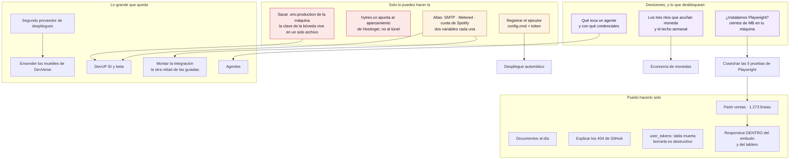

# Traspaso · 29 de agosto de 2026

Continúa [`traspaso-2026-08-27-temas-y-movimiento.md`](traspaso-2026-08-27-temas-y-movimiento.md),
que a partir de aquí queda desfasado: su grafo daba por pendientes cosas que ya
están en producción.

**Todo lo que se cuenta aquí está desplegado**, no solo commiteado.

---

## 1. Qué hacer ahora — el grafo

Las flechas son dependencias reales. En rojo lo que bloquea; en naranja lo que
depende de un tercero; en morado, decisiones.



**Lo que más pesa y menos cuesta:** copiar `.env.production` a un gestor de
contraseñas. Es un copiar y pegar de 3 KB, y es lo único que hoy separa «perder
la máquina cuesta una tarde» de «perder la máquina cuesta la bóveda entera».

---

## 2. Lo hecho, y por qué se decidió así

### Las tres promesas, en pie

**Vista de entornos y despliegues.** Pregunta a GitHub y no despliega nada: la
decisión cerrada es orquestar. Lo más difícil de leer de esa API es que está en
dos mitades — `/deployments` dice qué se pidió desplegar y el estado vive en una
lista aparte, así que un despliegue sin estado no es uno fallido sino uno que
aún no empezó.

**Base de datos como código.** Lee las migraciones del cliente y las pasa por el
criterio. Lo que se vende no es leer archivos: es saber qué mirar.

**Integraciones guiadas.** Qué se está resolviendo a mano y qué lo ahorraría,
**con la prueba delante**. Sin archivo y línea esto sería publicidad dentro de
una herramienta de trabajo.

### DevVerse, por fin abierto

Cartelera con nombre, rol y estado —y el tercer estado, *ocupado pero abierto a
llamadas*, que es el que ninguna herramienta tiene—. Acercarse abre un menú, y
las cámaras solo se encienden si los dos aceptan: eso es lo que hace la idea
compatible con el cifrado de extremo a extremo. La pizarra va por el canal de
datos de esa misma conexión, así que el servidor nunca ve lo que se dibuja.

### La interfaz que nunca tuvo armazón

Armazón de organización, marco de página, diálogo de confirmación, primitivas
que faltaban, capa de datos con caché, paleta de comandos y muestrario. Los ocho
`confirm()` del sistema operativo son cero.

---

## 3. Lo que aprendí a base de equivocarme

**Correr el análisis contra uno mismo encuentra lo que las pruebas inventadas
no.** El criterio de migraciones, aplicado a nuestras propias 24, marcó dos
errores — y las dos veces el equivocado era yo: `drop not null` no pierde datos,
y «RLS sin política» falla *cerrado*, no abierto. El diagnóstico de
integraciones, aplicado a este repositorio, descubrió que solo miraba el
`package.json` de la raíz: a un monorepo le diagnosticaba un proyecto vacío.

**Comprobar el resultado desplegado, no que la compilación pasó.** Di por
arreglado el alto de pantalla en móvil y al mirar el CSS que servía producción
seguía habiendo un `100vh`: había cambiado las pantallas y no las raíces que las
envuelven.

**El panel de vista previa no repinta al cambiar de tema.** Dos veces creí ver
un fallo en el tema claro que no existía. Los valores calculados y la
maquetación del DOM son la fuente fiable; la captura, no.

**No lanzar `npm run build` con el servidor de desarrollo corriendo.** Le pisa
`.next` y responde 500 a todo, con un error que no menciona la causa. Van dos
veces.

---

## 4. Lo que no se toca

| | |
|---|---|
| **Docker Desktop** | Se abre a mano y solo mientras se trabaja: es un MVP. Los contenedores vuelven solos al abrirlo |
| **`VAULT_MASTER_KEY`** | Ya se puede rotar (`npm run boveda:rotar`), pero sigue existiendo en un solo archivo sin copia |
| **RLS falla en silencio** | Tabla sin política = 0 filas y ningún error. Toda tabla nueva necesita política **y** caso de prueba |
| **`/dev` y el aislamiento** | Se entra por navegación dura (`<a>`, no `<Link>`): convertirlo en `<Link>` rompe WebContainer |
| **Spotify en modo desarrollo** | 5 cuentas de techo y las canciones de una lista no se pueden leer. No se arregla con código |
| **El repositorio es público** | No hay secretos dentro, pero sí 32 documentos de estrategia |

---

## 5. Comprobar que sigue en pie

```bash
npm run typecheck && npm run test:rls && npm run test:world
npm run test:migraciones && npm run test:integraciones
npm run respaldo:probar
```

Los seis en verde antes de empezar nada. El último es el que dice si el respaldo
sirve, y conviene correrlo aunque no se vaya a tocar nada.

Y una que es nueva: si en `respaldos/base-de-datos/` aparecen varios
`.parcial-*.dump` de cero bytes seguidos y ningún `devup-*.dump` entre ellos, el
respaldo está fallando aunque el contenedor se vea levantado.
